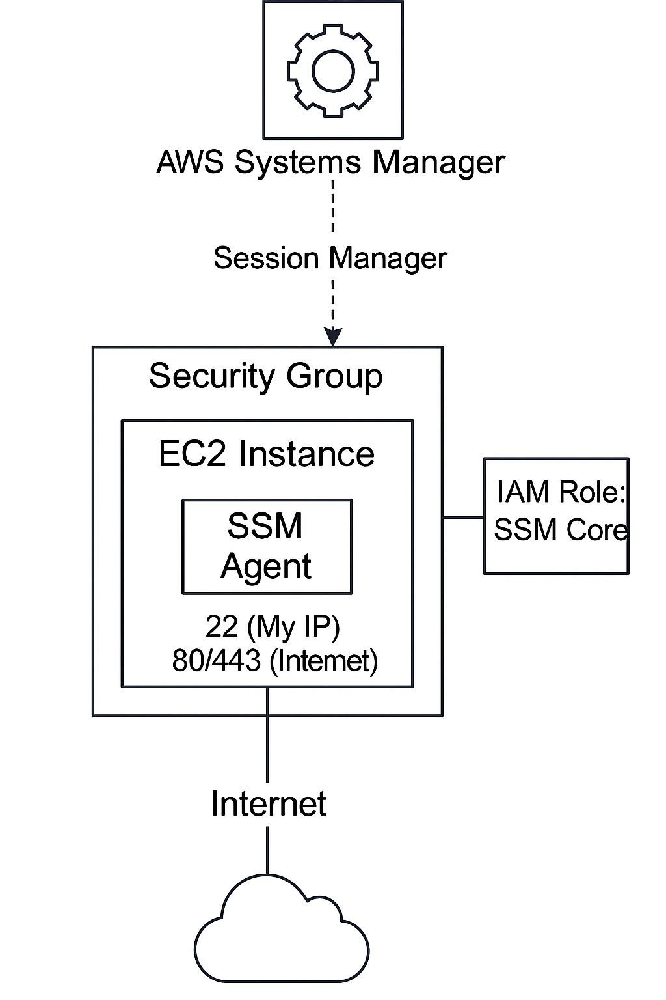

## AWS EC2 Hardening Lab

Hardened EC2 deployment using least privilege IAM roles, restricted security groups, SSM-based management, and OS-level controls for secure, auditable AWS compute.

---

## Table of Contents

- [Overview]
- [Objectives]
- [Steps Performed]
  - [1. IAM Role Creation]
  - [2. Security Group Configuration]
  - [3. EC2 Launch with Hardened Settings]
  - [4. SSM Access Verification]
  - [5. System Hardening]
  - [6. Verification and Documentation]
- [Screenshots]
- [Lessons Learned]
- [References]

---

## Overview

This project demonstrates the process of securely deploying and hardening an Amazon EC2 instance in AWS, following CIS benchmarks and AWS best practices. The lab focuses on minimizing attack surface, enforcing least privilege, automating instance management, and implementing essential security controls.

---

## Diagram

---

## Objectives

- Launch an EC2 instance using secure defaults
- Apply a Security Group allowing only necessary traffic (SSH, HTTP, HTTPS)
- Attach an IAM role with minimum permissions required for SSM management
- Enforce use of AWS Systems Manager Session Manager instead of public SSH access
- Harden the operating system by disabling root login, password authentication, and ensuring system patching
- Enable system auditing with `auditd`

---

## Steps Performed

1. IAM Role Creation
   -Created a new IAM role and attached the `AmazonSSMManagedInstanceCore` policy to enable SSM management for the EC2 instance, adhering to least privilege principles.

2. Security Group Configuration
   - Defined inbound rules to only allow:
      - SSH (port 22) — restricted to my IP address
      - HTTP (port 80) — open to the internet
      - HTTPS (port 443) — open to the internet
   - All other inbound traffic is denied.

3. EC2 Launch with Hardened Settings
   - Launched an Amazon Linux EC2 instance with the configured security group and IAM role.  
   - Set Instance Metadata Service to IMDSv2 only for additional protection against metadata exposure.

4. SSM Access Verification
   - Used AWS Systems Manager Session Manager to connect securely to the instance, eliminating the need for public SSH and associated risks.

5. System Hardening
   - SSH Hardening: Disabled root login and password authentication in `/etc/ssh/sshd_config`
   - OS Updates: Applied all available security updates and patches
   - System Auditing: Installed, enabled, and started the `auditd` service for auditing system-level events

6. Verification and Documentation
   - Collected before-and-after evidence (screenshots) to demonstrate the impact of hardening actions and verify settings.

---

## Screenshots

*All relevant screenshots demonstrating each step are included in the screenshots/ folder of this repository.

| Order | File Name                  | What it Shows                                 |
| ----- | -------------------------- | --------------------------------------------- |
| 1     | iam-role-policy-attach.png | IAM role policy attached for SSM              |
| 2     | sg-inbound-rules.png       | Security Group inbound firewall rules         |
| 3     | ec2-advanced-details.png   | IAM role in EC2 advanced details              |
| 4     | ec2-advanced-details-2.png | Metadata v2 in EC2 advanced details           |
| 5     | ec2-launch-summary.png     | EC2 launch summary (shows all config)         |
| 6     | ssm-session.png            | SSM Session Manager access (browser terminal) |
| 7     | ssm-fleet-managed.png      | SSM Fleet Manager—instance is “Managed”       |
| 8     | sshd-before.png            | SSH config before hardening                   |
| 9     | sshd-after.png             | SSH config after hardening                    |
| 10    | os-update.png              | OS/system update completion                   |
| 11    | auditd-status.png          | auditd running and enabled                    |

## Screenshot Explanations

1. iam-role-policy-attach.png: Attached the 'AmazonSSMManagedInstanceCore' policy to a new IAM role. This ensures the EC2 instance only has the minimum permissions needed for SSM management, following the principle of least privilege.

2. sg-inbound-rules.png: Configured the Security Group to only allow inbound traffic on ports 22 (SSH, limited to my IP), 80 (HTTP), and 443 (HTTPS). All other ports remain blocked for better security.

3. ec2-advanced-details.png: During EC2 launch, selected the IAM role for SSM access and set Instance Metadata Service to “V2 only” for improved metadata security.

4. ec2-advanced-details-2.png: Alternate or additional view showing the same advanced settings to further document proper instance configuration.

5. ec2-launch-summary.png: Review page showing all instance launch settings—confirms the right security group and IAM role were selected before starting the EC2 instance.

6. ssm-session.png: Proved secure access to the EC2 instance using AWS Systems Manager Session Manager. This method avoids exposing SSH to the internet, reducing attack surface.

7. ssm-fleet-managed.png: Verified in SSM Fleet Manager that the instance is registered as “Managed.” This confirms SSM Agent is running and the IAM role is working.

8. sshd-before.png
Captured the initial state of the SSH configuration file, showing default settings for 'PermitRootLogin' and 'PasswordAuthentication' before hardening.

9. sshd-after.png: After running hardening commands, both 'PermitRootLogin' and 'PasswordAuthentication' are set to no, in line with CIS and AWS best practices.

10. os-update.png: Ran a full system update using the OS package manager to ensure all security patches and updates are applied.

11. auditd-status.png: Enabled and started the auditd service to monitor and log system-level activity for improved incident response and auditing.

---

## Lessons Learned

- Restricting network and IAM permissions is essential for minimizing attack surface.
- SSM Session Manager provides a more secure alternative to SSH for administrative access.
- Hardening SSH settings and keeping systems updated significantly improves security posture.
- Enabling auditing (auditd) helps detect and investigate unauthorized or suspicious activity.

---

## References

- CIS Amazon Linux 2 Benchmark
  https://www.cisecurity.org/benchmark/amazon_linux/

- AWS EC2 Security Best Practices
  https://docs.aws.amazon.com/AWSEC2/latest/UserGuide/ec2-best-practices.html

- AWS Systems Manager Documentation
  https://docs.aws.amazon.com/systems-manager/

---

Sebastian Silva C. - July, 2025 - Berlin, Germany.
